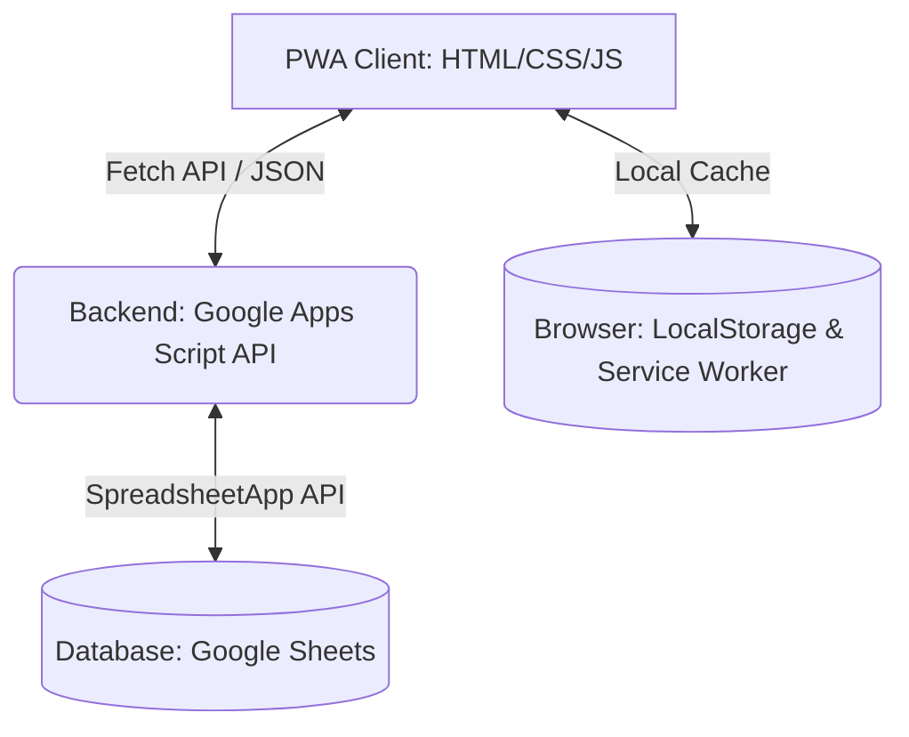
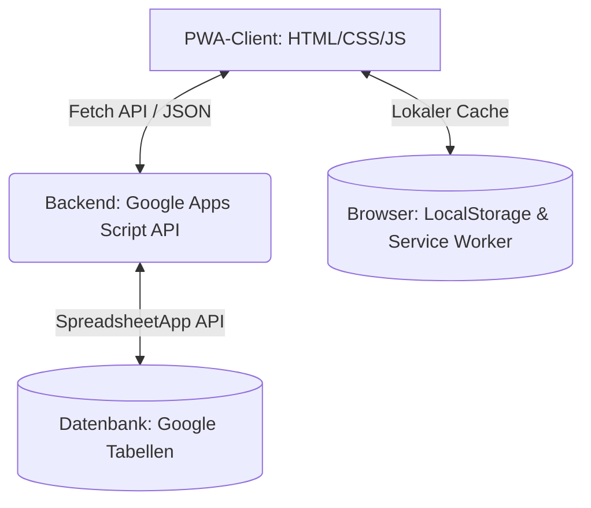
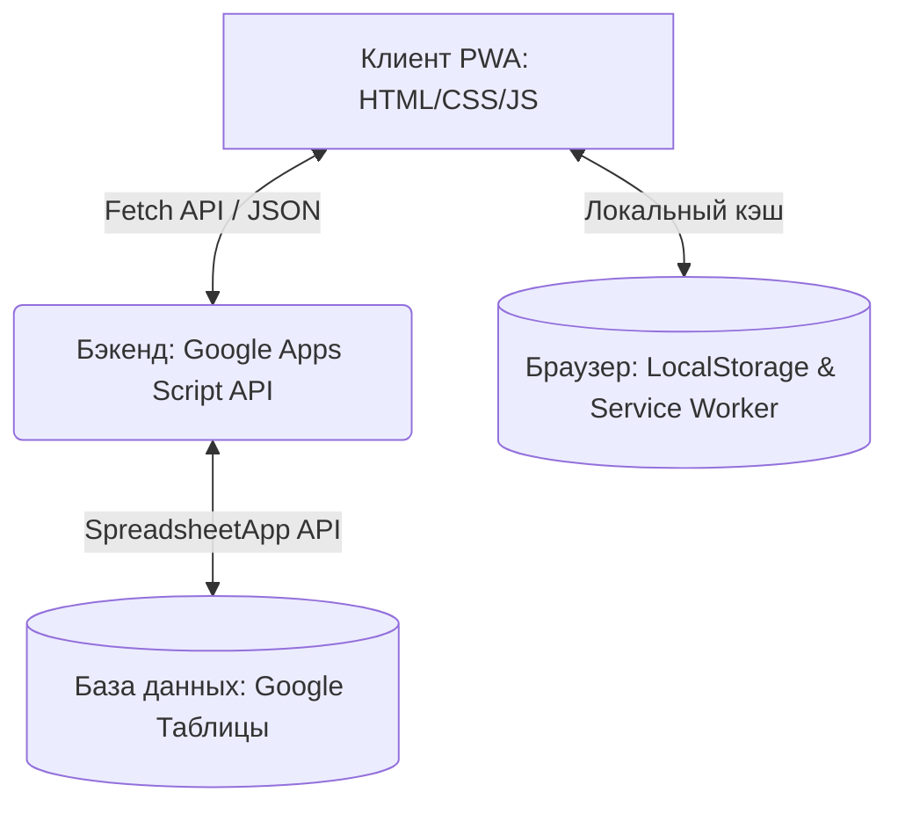

# Trolley Dienst / Запись на тележке — Slot Booking System / Schichtbuchungssystem / Система бронирования смен

[English](#english) | [Deutsch](#deutsch) | [Русский](#русский)

---

## English

**Trolley Dienst** is a modern Progressive Web Application (PWA) built with an **Offline-First** architecture. It is designed to manage shift schedules and book slots for public trolley witnessing, optimized for mobile devices, and integrated with a Google Sheets database.

### 1. Architecture & Tech Stack

The project uses a serverless hybrid architecture (Serverless Client + Sheets DB) for fast load times and offline accessibility.

* **Client-side**: HTML5, CSS3 (variables, transitions, system dark mode support), vanilla ES6+ JS split into interface logic ([app.js](file:///c:/Users/vital/Downloads/booking-Add-main/booking-Add-main/app.js)) and sync logic ([app-sync.js](file:///c:/Users/vital/Downloads/booking-Add-main/booking-Add-main/app-sync.js)).
* **Offline PWA**: Service Worker ([sw.js](file:///c:/Users/vital/Downloads/booking-Add-main/booking-Add-main/sw.js)) with `Cache-First` strategy.
* **Backend**: Google Apps Script (GAS) API handling `GET`/`POST` requests and communicating with the spreadsheet.
* **Multilingualism**: Split into three client files for different congregations:
  * [index.html](file:///c:/Users/vital/Downloads/booking-Add-main/booking-Add-main/index.html) — Russian (RU)
  * [index_ua.html](file:///c:/Users/vital/Downloads/booking-Add-main/booking-Add-main/index_ua.html) — Ukrainian (UA)
  * [index_de.html](file:///c:/Users/vital/Downloads/booking-Add-main/booking-Add-main/index_de.html) — German (DE)

### 2. Infrastructure & Deployment

#### Frontend: Hosting & CI/CD (Vercel + GitHub)
1. Code repository is hosted on **GitHub**.
2. Deployment is managed via **Vercel** with automatic triggers on commits to the `main` branch.

#### Backend: Google Apps Script (GAS)
Backend API code is located in [google_script.txt](file:///c:/Users/vital/Downloads/booking-Add-main/booking-Add-main/google_script.txt).

> [!IMPORTANT]
> When modifying the GAS backend code, always deploy a **New Version**:
> 1. Go to **Deploy** -> **Manage deployments**.
> 2. Edit the active deployment, select **New version** in the dropdown, and click **Deploy**.

### 3. Key Features

* **Offline-First FIFO Queue**: Bookings/deletions made offline are cached in `localStorage` under `offlineActions` and synced automatically when connection returns.
* **Incremental Rendering**: The calendar grid updates classes and text content inline instead of re-rendering all cells.
* **Adaptive Polling**: Auto-sync switches from 60 seconds to 10 minutes after 5 minutes of user inactivity, and pauses when tab is hidden.
* **Security**: Password authorization matched in real-time with the spreadsheet.
* **Haptic Feedback**: Custom haptic patterns (`navigator.vibrate`) for successful logins, bookings, tab switches, and warnings.

### 4. Admin Guide

#### Managing Users
User data is stored on the **`Users`** sheet. Columns must be structured as follows:

| Column | Field | Description | Format |
| :--- | :--- | :--- | :--- |
| **A (1)** | Email | Unique email address | `user@example.com` (lowercase) |
| **B (2)** | Name | Full name | Text (e.g. `John Doe`) |
| **C (3)** | Status | User status | `active` / `активен` |
| **D (4)** | Role | User role | `admin` / `user` |
| **E (5)** | Password | Account password | Plain text |

---

## Deutsch

**Trolley Dienst** ist eine moderne Progressive Web App (PWA) mit einer **Offline-First-Architektur** zur Schichtplanung und Slot-Buchung für das Trolley-Predigtwerk. Das System ist für Mobilgeräte optimiert und nutzt Google Tabellen als Datenbank.

### 1. Architektur & Technologie-Stack

* **Frontend**: HTML5, CSS3 (Variablen, Übergänge, System-Dunkelmodus), Vanilla ES6+ JS aufgeteilt in Interfacedatei ([app.js](file:///c:/Users/vital/Downloads/booking-Add-main/booking-Add-main/app.js)) und Sync-Logik ([app-sync.js](file:///c:/Users/vital/Downloads/booking-Add-main/booking-Add-main/app-sync.js)).
* **Offline-Funktionalität**: Service Worker ([sw.js](file:///c:/Users/vital/Downloads/booking-Add-main/booking-Add-main/sw.js)) mit `Cache-First`-Strategie.
* **Backend**: Google Apps Script (GAS) API zur Verarbeitung von `GET`/`POST`-Anfragen.
* **Mehrsprachigkeit**: Aufgeteilt in drei Client-Seiten für verschiedene Gemeinden:
  * [index.html](file:///c:/Users/vital/Downloads/booking-Add-main/booking-Add-main/index.html) — Russische Gemeinde (RU)
  * [index_ua.html](file:///c:/Users/vital/Downloads/booking-Add-main/booking-Add-main/index_ua.html) — Ukrainische Gemeinde (UA)
  * [index_de.html](file:///c:/Users/vital/Downloads/booking-Add-main/booking-Add-main/index_de.html) — Deutsche Gemeinde (DE)

### 2. Infrastruktur & Bereitstellung

#### Frontend: Hosting & CI/CD (Vercel + GitHub)
1. Quellcode wird auf **GitHub** verwaltet.
2. Webhosting erfolgt über **Vercel** mit automatischen Produktions-Releases bei jedem Push auf den `main`-Branch.

#### Backend: Google Apps Script (GAS)
Der Backend-API-Code befindet sich in [google_script.txt](file:///c:/Users/vital/Downloads/booking-Add-main/booking-Add-main/google_script.txt).

> [!IMPORTANT]
> Nach Änderungen im GAS-Code muss eine **Neue Version** veröffentlicht werden:
> 1. Klicken Sie auf **Bereitstellen** -> **Bereitstellungen verwalten**.
> 2. Bearbeiten Sie die aktive Bereitstellung, wählen Sie im Dropdown **Neue Version** und klicken Sie auf **Bereitstellen**.

### 3. Hauptmerkmale

* **Offline-First & FIFO-Warteschlange**: Offline getätigte Aktionen werden lokal in der `offlineActions`-Warteschlange gespeichert und bei Netzwerkrückkehr chronologisch synchronisiert.
* **Inkrementelles Rendern**: Der Kalender aktualisiert bestehende DOM-Klassen und Texte direkt, anstatt alle Zellen neu zu generieren.
* **Adaptives Polling**: Das Aktualisierungsintervall sinkt bei Inaktivität nach 5 Minuten von 60 Sek. auf 10 Min. und stoppt, wenn die Registerkarte im Hintergrund läuft.
* **Sicherheit**: Passwort-Authentifizierung, die in Echtzeit mit der Benutzerliste in Google Tabellen abgeglichen wird.
* **Haptisches Feedback**: Vibrationsmuster (`navigator.vibrate`) bei erfolgreicher Anmeldung, Buchung, Warnungen und Registerkartenwechsel.

### 4. Administrator-Handbuch

#### Benutzerverwaltung
Benutzerdaten werden im Tabellenblatt **`Users`** verwaltet. Die Spaltenstruktur muss wie folgt aussehen:

| Spalte | Feld | Beschreibung | Format |
| :--- | :--- | :--- | :--- |
| **A (1)** | Email | E-Mail-Adresse | `user@example.com` (Kleinschreibung) |
| **B (2)** | Name | Vollständiger Name | Text (z.B. `Max Mustermann`) |
| **C (3)** | Status | Status des Benutzers | `active` / `активен` |
| **D (4)** | Role | Rolle | `admin` / `user` |
| **E (5)** | Password | Passwort | Klartext |

---

## Русский

**Запись на тележке** (Trolley Dienst) — это современное PWA-приложение (Progressive Web Application) с архитектурой **Offline-First**, разработанное для управления графиком дежурств и бронирования смен для служения с тележками.

### 1. Архитектура и стек технологий

* **Фронтенд**: HTML5, CSS3 (переменные темы, переходы, системный темный режим), ванильный ES6+ JS разделен на интерфейс ([app.js](file:///c:/Users/vital/Downloads/booking-Add-main/booking-Add-main/app.js)) и синхронизацию ([app-sync.js](file:///c:/Users/vital/Downloads/booking-Add-main/booking-Add-main/app-sync.js)).
* **Автономность**: Service Worker ([sw.js](file:///c:/Users/vital/Downloads/booking-Add-main/booking-Add-main/sw.js)) с кэшированием `Cache-First`.
* **Многоязычность**: Разделено на три страницы для различных языковых групп:
  * [index.html](file:///c:/Users/vital/Downloads/booking-Add-main/booking-Add-main/index.html) — Русскоязычное собрание (RU)
  * [index_ua.html](file:///c:/Users/vital/Downloads/booking-Add-main/booking-Add-main/index_ua.html) — Украинское собрание (UA)
  * [index_de.html](file:///c:/Users/vital/Downloads/booking-Add-main/booking-Add-main/index_de.html) — Немецкое собрание (DE)

### 2. Инфраструктура и развертывание

#### Фронтенд: Хостинг и CI/CD (Vercel + GitHub)
1. Код проекта размещен в репозитории на **GitHub**.
2. Хостинг фронтенда обеспечивается **Vercel** с автоматическим деплоем при пуше в ветку `main`.

#### Бэкенд: Google Apps Script (GAS)
Код API прописан в файле [google_script.txt](file:///c:/Users/vital/Downloads/booking-Add-main/booking-Add-main/google_script.txt).

> [!IMPORTANT]
> При изменении кода GAS необходимо создавать новый релиз ("Новую версию" развертывания веб-приложения):
> 1. В панели GAS выберите **Начать развертывание** -> **Управление развертываниями**.
> 2. Отредактируйте активное развертывание, выберите **Новая версия** и нажмите **Развернуть**.

### 3. Ключевые особенности и оптимизация

* **Offline-First и FIFO очередь**: Оффлайн-действия кэшируются в `localStorage` (`offlineActions`) и отправляются на сервер при восстановлении сети.
* **Инкрементальный DOM-апдейт**: Сетка календаря обновляет классы и текст ячеек напрямую, без полного перерендеривания.
* **Адаптивный опрос**: Фоновый опрос замедляется до 10 минут при простое пользователя более 5 минут и приостанавливается при скрытии вкладки.
* **Безопасность**: Авторизация по электронной почте и паролю, сверяемым с таблицей пользователей.
* **Тактильная отдача (Haptic Feedback)**: Виброотклики (`navigator.vibrate`) на успешные входы, отправки форм, ошибки и смены вкладок.

### 4. Руководство администратора

#### Список пользователей
Пользователи хранятся на листе **`Users`** в Google Таблице со следующей структурой колонок:

| Столбец | Поле | Описание | Формат данных |
| :--- | :--- | :--- | :--- |
| **A (1)** | Email | Электронная почта | `user@example.com` (строчные буквы) |
| **B (2)** | Name | Имя и фамилия возвещателя | Текст (например, `Иван Иванов`) |
| **C (3)** | Status | Флаг активности пользователя | `active` / `активен` |
| **D (4)** | Role | Роль пользователя | `admin` / `user` |
| **E (5)** | Password | Пароль пользователя | Обычный текст |